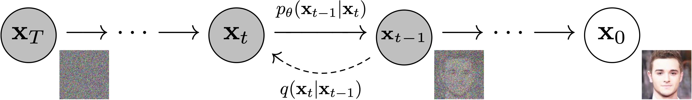

# Chapter 1: Introduction to Diffusion Models

**Course Overview:**

- 👩‍🎓 Study the theory behind diffusion models
- 🧨 Learn how to generate images and audio with the popular 🤗 Diffusers library
- 🏋️‍♂️ Train your own diffusion models from scratch
- 📻 Fine-tune existing diffusion models on new datasets
- 🗺 Explore conditional generation and guidance
- 🧑‍🔬 Create your own custom diffusion model pipelines

## What are Diffusion Models?

Definition:
- Diffusion models are generative models
- The goal is to learn to generate data
- A good model will create a diverse set of outputs

>Figure from DDPM paper (https://arxiv.org/abs/2006.11239)

General flow:
- Generation begins with random noise
- It's gradually regined over a number of steps
- Each step, the model estimates how we could go from the current input 
- Until the completely denoised version

Training flow:
- Load images from the training data
- Add noise in different amounts
- Feed the noisy version inputs into the model
- Evaluate how well the model does at denoising these inputs
- Use this information to update the model weights

Inference flow:
- Begin with a random input
- Repeatedly feed it through the model
- Update by small amount based on the model prediction